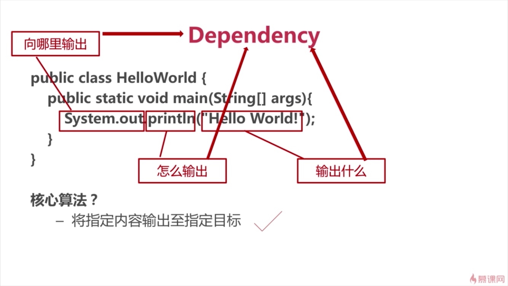

#### Dependency Injection：
代码中除了核心代码之外还需要依赖大量的其他代码，这些其他部分的代码就是Dependency，我们在处理这种代码时的办法是：
1. 首先找出代码中的Dependency：如一个算法的输入从哪里来，输出到哪里，控制算法的参数如何配置
2. 然后将这些Dependency：输入，输出和控制参数剥离出来
3. 最后需要一个框架(如Spring、Guice)将这些Dependency注入到核心代码中
#### Hello World程序改造
- Hello World依赖分析:

- 面向对象化改造:
    - step1:原始实现
        - main.java:
            ``` 
            public static void main(String[] args){
                System.out.println("Hello World");
            }
            ``` 
    - step2:main中进行方法提取
        - main.java:
            ```
            public static void main(String[] args){
                printHelloWorld();
            }
            public void printHelloWorld(){
                System.out.println("Hello World");
            }
            ```
    - step3:将main中提取的代码用类包装
        - main.java
            ```        
            public static void main(String[] args){
                new HelloWorldPrinter().printHelloWorld();
            }
            ```
        - HelloWorldPrinter.java
            ```
            public class HelloWorldPrinter(){
                public void printHelloWorld(){
                    System.out.println("Hello World");
                }
            }
            ```
    - step4:main中进行方法名的修改--也即是抽象类到具体类的加工
        - main.java
            ```        
            public static void main(String[] args){
                new getMainApplet().printHelloWorld();
            }
            private static HelloWorldPrinter getMainApplet(){ // 抽象到具体的转换:类是具体的类,方法名是抽象的名字(方法名的意思是得到抽象的一类类)
                return new HelloWorldPrinter(); 
            }
            ```
        - HelloWorldPrinter.java
            ```
            public class HelloWorldPrinter(){
                public void printHelloWorld(){
                    System.out.println("Hello World");
                }
            }
            ```
    - step5:提取出抽象类到具体类的转换逻辑
        - main.java
            ```        
            public static void main(String[] args){
                Configuration.getMainApplet().printHelloWorld();
            }
            ```
        - Configuration.java
            ```
            public class Configuration(){
                public static HelloWorldPrinter getMainApplet(){
                   return new HelloWorldPrinter();
                }
            }
            ```
        - HelloWorldPrinter.java
            ```
            public class HelloWorldPrinter(){
                public void printHelloWorld(){
                    System.out.println("Hello World");
                }
            }
            ```
    - step6:抽象main中类的方法--在实现类中实现该方法
        - main.java
            ```        
            public static void main(String[] args){
                Configuration.getMainApplet().run();
            }
            ```
        - Configuration.java
            ```
            public class Configuration(){
                public static HelloWorldPrinter getMainApplet(){
                   return new HelloWorldPrinter(); 
                }
            }
            ```
        - HelloWorldPrinter.java
            ```
            public class HelloWorldPrinter(){
                private void printHelloWorld(){
                    System.out.println("Hello World");
                }
                public void run(){
                    printHelloWorld();
                }
            }
            ```
    - step7:分析main中的类依赖
        - main.java
            ```        
            public static void main(String[] args){
                HelloWorldPrinter mainApplet = Configuration.getMainApplet();
                mainApplet.run();
            }
            ```
        - Configuration.java
            ```
            public static HelloWorldPrinter getMainApplet(){
                return new HelloWorldPrinter(); 
            }
            ```
        - HelloWorldPrinter.java
            ```
            private void printHelloWorld(){
                System.out.println("Hello World");
            }
            public void run(){
                printHelloWorld();
            }
            ```
    - step8:抽象出main中的依赖(类名为一类类的名字)--提取出接口,并在实现类中实现该接口
        - main.java
            ```        
            public static void main(String[] args){
                MyApplet mainApplet = Configuration.getMainApplet();
                mainApplet.run();
            }
            ```
        - Configuration.java
            ```
            public class Configuration{
                public static MyApplet getMainApplet(){
                    return new HelloWorldPrinter(); 
                }    
            }
            ```
        - MyApplet.java
            ```
            public interface MyApplet{
                void run()
            }
            ```
        - HelloWorldPrinter.java
            ```
            public class HelloWorldPrinter implements MyApplet{
                private void printHelloWorld(){
                    System.out.println("Hello World");
                }
                public void run(){
                    printHelloWorld();
                }
            }    
            ```
- 提取Dependency:
    - step1:提取出System.out,用构造函数初始化
        - main.java
            ```        
            public static void main(String[] args){
                MyApplet mainApplet = Configuration.getMainApplet();
                mainApplet.run();
            }
            ```
        - MyApplet.java
            ```
            public interface MyApplet{
                void run()
            }
            ```
        - HelloWorldPrinter.java
            ```
            public class HelloWorldPrinter implements MyApplet{
                private PrintStream destination;
                public HelloWorldPrinter(PrintStream destination) {
                    super();
                    this.destination = destination;
                }
                private void printHelloWorld() {
                    // destination就是HelloWorldPrinter的一个Dependency
                    // System.out就是HelloWorldPrinter的一个Dependency Injection--用构造函数注入
                    destination.println("Hello World");
                }
                public void run() {
                    printHelloWorld();
                }
            }   
            ```
        - Configuration.java
            ```
            public class Configuration{
                public static MyApplet getMainApplet(){
                    return new HelloWorldPrinter(System.out); 
                }    
            }
            ```
    - step2：提取出println,将写的方法和输出的位置用PrintStreamWriter包装(包装内部的write还是调用的println)
        - main.java
            ```        
            public static void main(String[] args){
                MyApplet mainApplet = Configuration.getMainApplet();
                mainApplet.run();
            }
            ```
        - MyApplet.java
            ```
            public interface MyApplet{
                void run()
            }
            ```
        - HelloWorldPrinter.java
            ```
            public class HelloWorldPrinter implements MyApplet{
                private MyDestination destination;
                public HelloWorldPrinter(MyDestination destination) {
                    super();
                    this.destination = destination;
                }
                private void printHelloWorld() {
                    destination.write("Hello World");
                }
                public void run() {
                    printHelloWorld();
                }
            }   
            ```
        - MyDestination.java
            ```
            public interface MyDestination(){
                void write(String str);
            }
            ```
        - PrintStreamWriter.java
            ```
            public calss PrintStreamWriter implements MyDestination{
                private PrintStream destination;
                public PrintStreamWriter(PrintStream destination){
                    super();
                    this.destination = destination;
                }
                @Override
                public void write(String str){
                    destination.println(str);
                }
            }
            ```
        - Configuration.java
            ```
            public class Configuration{
                public static MyApplet getMainApplet(){
                    return new HelloWorldPrinter(new PrintStreamWriter(System.out)); 
                }    
            }
            ```
    - step3:提取出"Hello World",在构造函数中初始化
        - main.java
            ```        
            public static void main(String[] args){
                MyApplet mainApplet = Configuration.getMainApplet();
                mainApplet.run();
            }
            ```
        - MyApplet.java
            ```
            public interface MyApplet{
                void run()
            }
            ```
        - MyDestination.java
            ```
            public interface MyDestination(){
                void write(String str);
            }
            ```
        - PrintStreamWriter.java
            ```
            public calss PrintStreamWriter implements MyDestination{
                private PrintStream destination;
                public PrintStreamWriter(PrintStream destination){
                    super();
                    this.destination = destination;
                }
                @Override
                public void write(String str){
                    destination.println(str);
                }
            }
        - HelloWorldPrinter.java
            ```
            public class HelloWorldPrinter implements MyApplet{
                private MyDestination destination;
                private String outputString;
                public HelloWorldPrinter(MyDestination destination,String outputstring) {
                    super();
                    this.destination = destination;
                    this.outputString = outputstring
                }
                private void printHelloWorld() {
                    destination.write(outputstring);
                }
                public void run() {
                    printHelloWorld();
                }
            }   
            ```
        - Configuration.java
            ```
            public class Configuration{
                public static MyApplet getMainApplet(){
                    return new HelloWorldPrinter(new PrintStreamWriter(System.out),"Hello World"); 
                }    
            }
            ```
    - step4:重命名HelloWorldPrinter为StringWritingApplet
        - main.java
            ```        
            public static void main(String[] args){
                MyApplet mainApplet = Configuration.getMainApplet();
                mainApplet.run();
            }
            ```
        - MyApplet.java
            ```
            public interface MyApplet{
                void run()
            }
            ```
        - MyDestination.java
            ```
            public interface MyDestination(){
                void write(String str);
            }
            ```
        - PrintStreamWriter.java
            ```
            public calss PrintStreamWriter implements MyDestination{
                private PrintStream destination;
                public PrintStreamWriter(PrintStream destination){
                    super();
                    this.destination = destination;
                }
                @Override
                public void write(String str){
                    destination.println(str);
                }
            }
        - StringWritingApplet.java
            ```
            public class StringWritingApplet implements MyApplet{
                private MyDestination destination;
                private String outputString;
                public StringWritingApplet(MyDestination destination,String outputstring) {
                    super();
                    this.destination = destination;
                    this.outputString = outputstring
                }
                private void writeString() {
                    destination.write(outputstring);
                }
                public void run() {
                    writeString();
                }
            }   
            ```
        - Configuration.java
            ```
            public class Configuration{
                public static MyApplet getMainApplet(){
                    return new StringWritingApplet(new PrintStreamWriter(System.out),"Hello World"); 
                }    
            }
            ```
    - step5:修改"Hello World"字符串常量为StringProvider提供,案例中由匿名类实现
        - main.java
            ```        
            public static void main(String[] args){
                MyApplet mainApplet = Configuration.getMainApplet();
                mainApplet.run();
            }
            ```
        - MyApplet.java
            ```
            public interface MyApplet{
                void run()
            }
            ```
        - MyDestination.java
            ```
            public interface MyDestination(){
                void write(String str);
            }
            ```
        - PrintStreamWriter.java
            ```
            public calss PrintStreamWriter implements MyDestination{
                private PrintStream destination;
                public PrintStreamWriter(PrintStream destination){
                    super();
                    this.destination = destination;
                }
                @Override
                public void write(String str){
                    destination.println(str);
                }
            }
        - StringWritingApplet.java
            ```
            public class StringWritingApplet implements MyApplet{
                private MyDestination destination;
                private StringProvider stringProvider;
                public StringWritingApplet(MyDestination destination,StringProvider stringProvider) {
                    super();
                    this.destination = destination;
                    this.stringProvider = stringProvider
                }
                private void writeString() {
                    destination.write(stringProvider.get());
                }
                public void run() {
                    writeString();
                }
            }   
            ```
        - StringProvider.java
            ```
            public interface StringProvider(){
                String get();
            }
            ```
        - Configuration.java
            ```
            public class Configuration{
                public static MyApplet getMainApplet(){
                    return new StringWritingApplet(new PrintStreamWriter(System.out),new StringProvider(){
                        @Override
                        public String get(){
                            return "Hello World";
                        }
                    }); 
                }    
            }
            ```
- Dependency剥离示意:

- 使用Guice配置Dependency:


<!-- - Alt+1--文件栏和编辑栏切换
- 文件栏Alt+Insert--新建快捷键
- 编辑栏Alt+Insert--Generate快捷键：setter/getter/Constructor...
- 编辑栏Alt+Enter--提示操作
- Alt+向上/下箭头--上一个/下一个方法 -->
